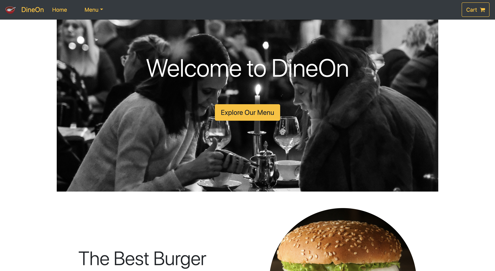
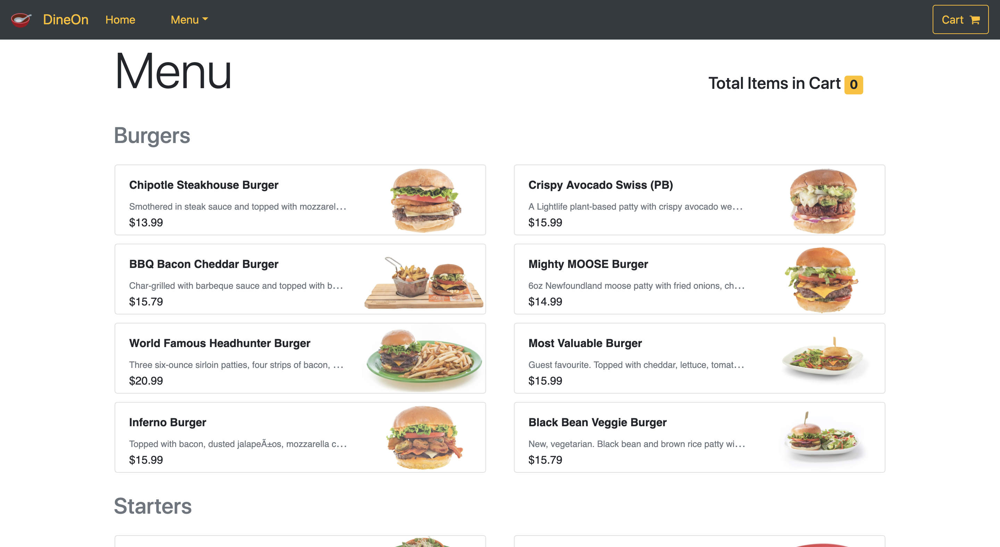
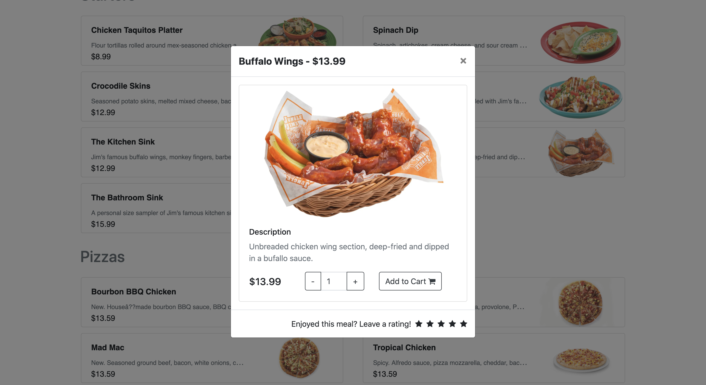
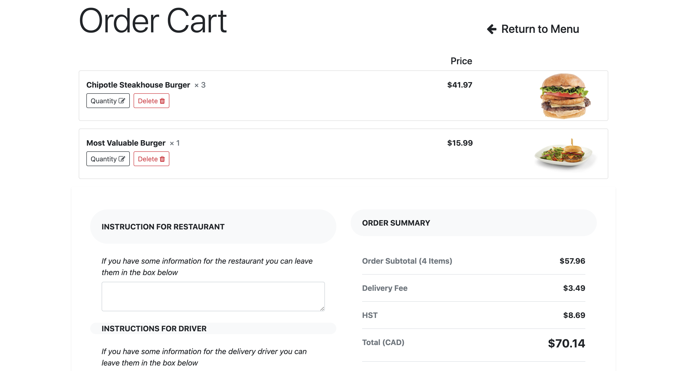
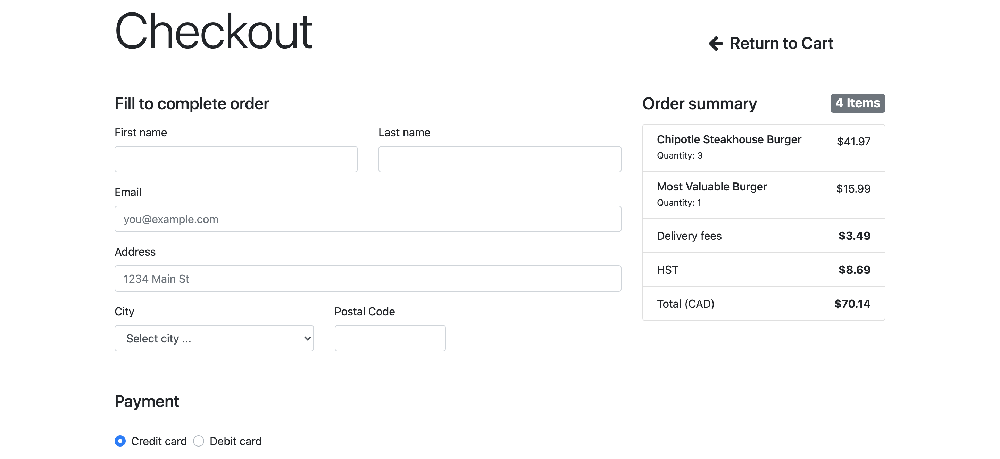

# DineOn
Meal Ordering Application Using ASP.Net Core MVC and Blazor Server

Live Demo Available [Here](http://dineon.azurewebsites.net/)

## Images






## Features Test
- Responsive web design
  - [See mobile emulators](https://www.responsinator.com/?url=https%3A%2F%2Fdineon.azurewebsites.net%2F)
- High performance. Gets 89/100 points on Google PageSpeed Insights for Desktop
  - [Run PageSpeed Insights](https://developers.google.com/speed/pagespeed/insights/?url=https%3A%2F%2Fdineon.azurewebsites.net%2F&tab=desktop)


## How to use

On the command line, install the template.

```cmd
cd DineOn
dotnet watch run
```

After the command shell indicates that the app has started, browse to 

```cmd
https://localhost:5001
```
